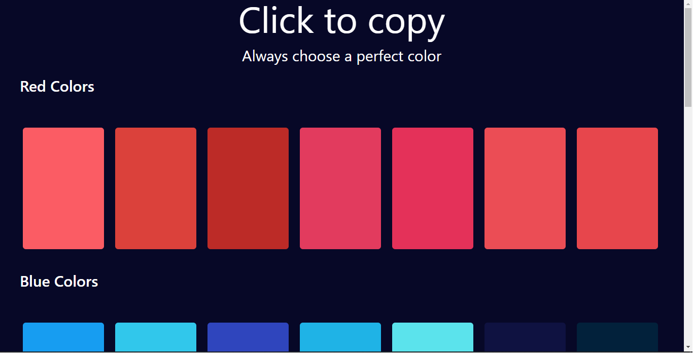
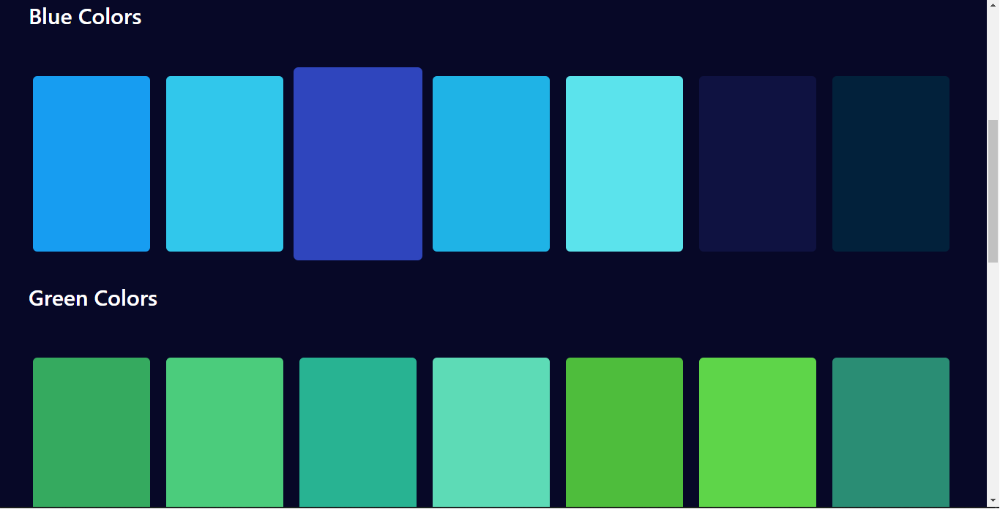

`Over view`

> Technology [Html, Tailwind css, Javascript]

## Check out the app [[Choosecolors](https://choosecolors.netlify.app/)]

### By clicking the color box user can copy the color

**First Image**

**Second Image**

.

### For all color cards , I am using Javacript. I just create a single Card and iterate all card using `Colors array` or `map()` . After apped all card inside the main Color div. For css part i am using Tailwind css . I haven't write single line of css code.
